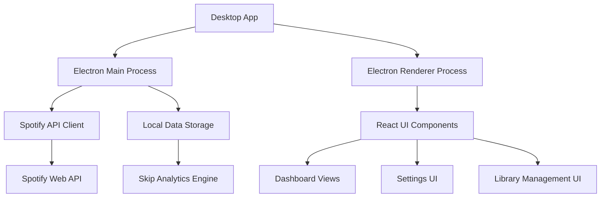
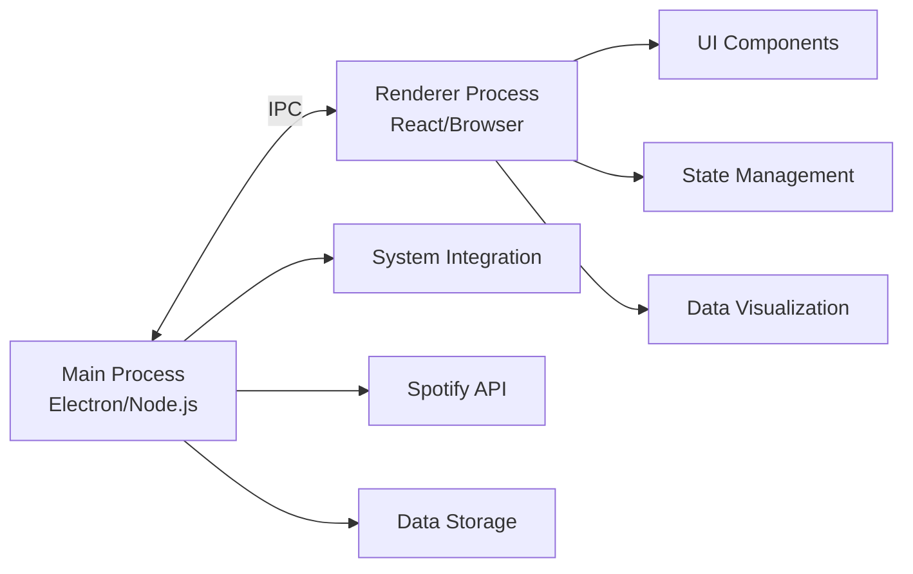
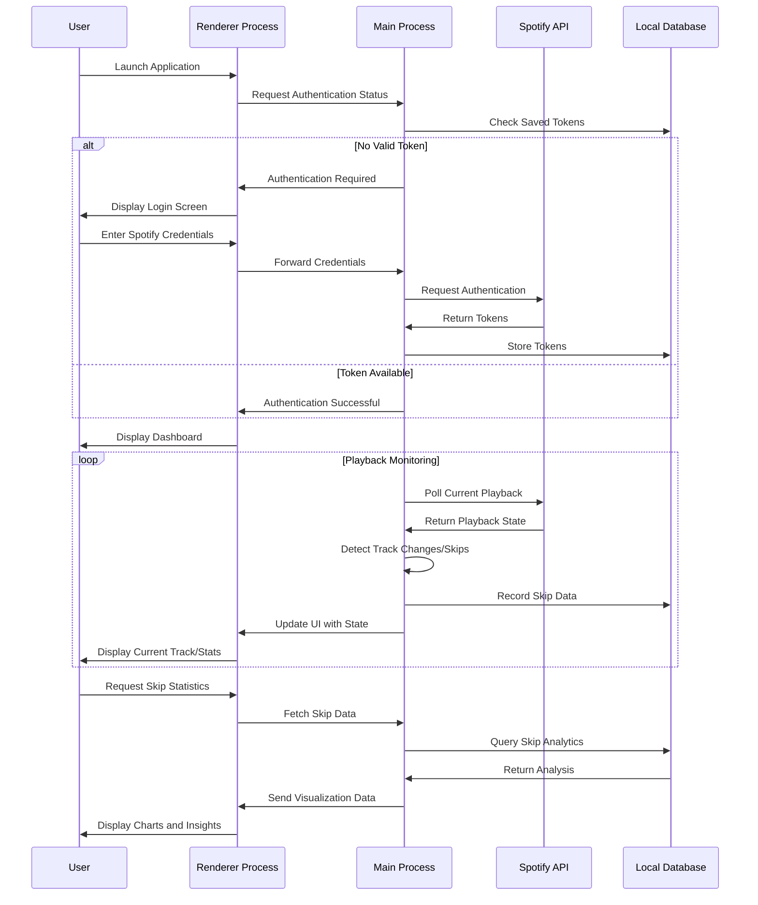

# Architecture for Spotify Skip Tracker

Status: Approved

## Technical Summary

Spotify Skip Tracker is a cross-platform desktop application built using Electron and React with TypeScript. The application follows a multi-process architecture with separate main (Electron/Node.js) and renderer (React/Browser) processes. The main process handles Spotify API integration, playback monitoring, and data persistence, while the renderer process manages the user interface and data visualization. Communication between processes is facilitated through Electron's IPC mechanism. The application employs a component-based architecture with React for the UI, and leverages modern libraries such as Tailwind CSS, Radix UI, and Recharts for styling and visualization.

## Technology Table

| Technology      | Description                                      |
| --------------- | ------------------------------------------------ |
| Electron        | Cross-platform desktop application framework     |
| React           | UI library for building the user interface       |
| TypeScript      | Programming language for type-safe JavaScript    |
| Vite            | Build tool and development server                |
| Tailwind CSS    | Utility-first CSS framework for styling          |
| Radix UI        | Accessible component primitives                  |
| shadcn/ui       | Component library built on Radix UI and Tailwind |
| Recharts        | Charting library for data visualization          |
| Spotify Web API | API for Spotify integration                      |
| Electron Store  | Persistent storage for application data          |
| React Router    | Routing library for navigation                   |
| Vitest          | Testing framework                                |
| Zod             | TypeScript-first schema validation               |
| React Hook Form | Form handling library                            |

## Architectural Diagrams

### High-Level Architecture



### Process Separation



### Application Flow



## Data Models, API Specs, Schemas, etc

### Track Skip Data Schema

```json
{
  "track_id": "string",
  "track_name": "string",
  "artist_name": "string",
  "album_name": "string",
  "skip_timestamp": "datetime",
  "play_duration_ms": "number",
  "track_duration_ms": "number",
  "skip_percentage": "number",
  "context": {
    "type": "string",
    "source": "string",
    "device_id": "string"
  }
}
```

### Settings Schema

```json
{
  "skipDetection": {
    "thresholdPercentage": "number",
    "minimumSkips": "number"
  },
  "libraryManagement": {
    "autoRemove": "boolean",
    "analysisTimeframe": "string"
  },
  "userInterface": {
    "theme": "string",
    "chartColors": "string[]"
  },
  "spotify": {
    "clientId": "string",
    "refreshToken": "string"
  }
}
```

### Spotify Authentication Flow

```json
{
  "authorizationUrl": "https://accounts.spotify.com/authorize",
  "tokenUrl": "https://accounts.spotify.com/api/token",
  "redirectUri": "http://localhost:8888/callback",
  "scopes": [
    "user-read-playback-state",
    "user-modify-playback-state",
    "user-library-modify",
    "user-library-read",
    "user-read-recently-played"
  ]
}
```

## Project Structure

```text
Spotify-Skip-Tracker
├── config
│   └── eslint.config.mjs
├── docs
├── src
│   ├── assets
│   │   ├── fonts
│   │   │   ├── geist
│   │   │   │   └── geist.ttf
│   │   │   ├── geist-mono
│   │   │   │   └── geist-mono.ttf
│   │   │   └── tomorrow
│   │   │       ├── tomorrow-bold-italic.ttf
│   │   │       ├── tomorrow-bold.ttf
│   │   │       ├── tomorrow-italic.ttf
│   │   │       └── tomorrow-regular.ttf
│   │   ├── SpotifySkipTrackerIconTransparent.icns
│   │   ├── SpotifySkipTrackerIconTransparent.ico
│   │   └── SpotifySkipTrackerIconTransparent.png
│   ├── components
│   │   ├── settings
│   │   │   ├── ApiCredentialsForm.tsx
│   │   │   ├── ApplicationSettingsForm.tsx
│   │   │   ├── ImportExportSettings.tsx
│   │   │   ├── ResetSettingsDialog.tsx
│   │   │   ├── RestartDialog.tsx
│   │   │   ├── settingsFormSchema.ts
│   │   │   └── SkipDetectionForm.tsx
│   │   ├── skippedTracks
│   │   │   ├── dialogs
│   │   │   │   ├── ClearDataDialog.tsx
│   │   │   │   └── RemoveHighlightedDialog.tsx
│   │   │   ├── SkippedTrackRow.tsx
│   │   │   ├── SkippedTracksBulkActions.tsx
│   │   │   ├── SkippedTracksHeader.tsx
│   │   │   ├── SkippedTracksTable.tsx
│   │   │   ├── TrackActionsMenu.tsx
│   │   │   └── utils.ts
│   │   ├── spotify
│   │   │   ├── AuthenticationCard.tsx
│   │   │   ├── LogsCard.tsx
│   │   │   ├── NowPlayingCard.tsx
│   │   │   └── PlaybackMonitoringCard.tsx
│   │   ├── statistics
│   │   │   ├── ArtistsTab.tsx
│   │   │   ├── ClearStatisticsDialog.tsx
│   │   │   ├── DevicesTab.tsx
│   │   │   ├── index.ts
│   │   │   ├── ListeningPatternsTab.tsx
│   │   │   ├── NoDataMessage.tsx
│   │   │   ├── OverviewTab.tsx
│   │   │   ├── SessionsTab.tsx
│   │   │   ├── SkipPatternsTab.tsx
│   │   │   ├── TimeAnalyticsTab.tsx
│   │   │   ├── TracksTab.tsx
│   │   │   └── utils.ts
│   │   ├── ui
│   │   │   ├── alert-dialog.tsx
│   │   │   ├── badge.tsx
│   │   │   ├── button.tsx
│   │   │   ├── card.tsx
│   │   │   ├── chart.tsx
│   │   │   ├── collapsible.tsx
│   │   │   ├── dropdown-menu.tsx
│   │   │   ├── form.tsx
│   │   │   ├── input.tsx
│   │   │   ├── label.tsx
│   │   │   ├── navigation-menu.tsx
│   │   │   ├── progress.tsx
│   │   │   ├── scroll-area.tsx
│   │   │   ├── select.tsx
│   │   │   ├── separator.tsx
│   │   │   ├── skeleton.tsx
│   │   │   ├── slider.tsx
│   │   │   ├── sonner.tsx
│   │   │   ├── spinner.tsx
│   │   │   ├── switch.tsx
│   │   │   ├── table.tsx
│   │   │   ├── tabs.tsx
│   │   │   ├── toggle-group.tsx
│   │   │   ├── toggle.tsx
│   │   │   └── tooltip.tsx
│   │   ├── DragWindowRegion.tsx
│   │   └── ToggleTheme.tsx
│   ├── electron
│   │   ├── main
│   │   │   ├── extensions.ts
│   │   │   ├── installer-events.ts
│   │   │   ├── spotify-ipc.ts
│   │   │   ├── statistics-setup.ts
│   │   │   └── window.ts
│   │   └── main.ts
│   ├── helpers
│   │   ├── ipc
│   │   │   ├── theme
│   │   │   │   ├── theme-channels.ts
│   │   │   │   ├── theme-context.ts
│   │   │   │   └── theme-listeners.ts
│   │   │   ├── window
│   │   │   │   ├── window-channels.ts
│   │   │   │   ├── window-context.ts
│   │   │   │   └── window-listeners.ts
│   │   │   ├── context-exposer.ts
│   │   │   └── listeners-register.ts
│   │   ├── storage
│   │   │   ├── logs-store.ts
│   │   │   ├── settings-store.ts
│   │   │   ├── statistics-store.ts
│   │   │   ├── store.ts
│   │   │   ├── tracks-store.ts
│   │   │   └── utils.ts
│   │   ├── theme_helpers.ts
│   │   └── window_helpers.ts
│   ├── layouts
│   │   └── MainLayout.tsx
│   ├── pages
│   │   ├── HomePage.tsx
│   │   ├── SettingsPage.tsx
│   │   ├── SkippedTracksPage.tsx
│   │   └── StatisticsPage.tsx
│   ├── renderer
│   │   └── preload
│   │       └── preload.ts
│   ├── routes
│   │   ├── __root.tsx
│   │   ├── router.tsx
│   │   └── routes.tsx
│   ├── services
│   │   ├── auth
│   │   │   ├── storage
│   │   │   │   ├── index.ts
│   │   │   │   ├── token-init.ts
│   │   │   │   ├── token-operations.ts
│   │   │   │   ├── token-refresh.ts
│   │   │   │   ├── token-state.ts
│   │   │   │   ├── token-storage.ts
│   │   │   │   └── token-store.ts
│   │   │   ├── index.ts
│   │   │   ├── oauth.ts
│   │   │   ├── server.ts
│   │   │   ├── session.ts
│   │   │   └── window.ts
│   │   ├── playback
│   │   │   ├── history.ts
│   │   │   ├── index.ts
│   │   │   ├── monitor.ts
│   │   │   ├── skip-detection.ts
│   │   │   ├── state.ts
│   │   │   └── track-change.ts
│   │   ├── spotify
│   │   │   ├── auth.ts
│   │   │   ├── constants.ts
│   │   │   ├── credentials.ts
│   │   │   ├── index.ts
│   │   │   ├── interceptors.ts
│   │   │   ├── library.ts
│   │   │   ├── playback.ts
│   │   │   ├── token.ts
│   │   │   └── user.ts
│   │   ├── statistics
│   │   │   ├── aggregator.ts
│   │   │   ├── collector.ts
│   │   │   └── pattern-detector.ts
│   │   ├── api-retry.ts
│   │   ├── spotify.service.ts
│   │   └── token-storage.ts
│   ├── styles
│   │   └── global.css
│   ├── tests
│   │   └── unit
│   │       ├── components
│   │       │   └── ToggleTheme.test.tsx
│   │       ├── helpers
│   │       │   └── storage.test.ts
│   │       ├── services
│   │       │   ├── playback.test.ts
│   │       │   └── spotify.service.test.ts
│   │       └── setup.ts
│   ├── types
│   │   ├── auth.ts
│   │   ├── logging.ts
│   │   ├── playback.ts
│   │   ├── settings.ts
│   │   ├── spotify-api.ts
│   │   ├── spotify.ts
│   │   ├── statistics.ts
│   │   ├── theme-mode.ts
│   │   └── token.ts
│   ├── utils
│   │   └── tailwind.ts
│   ├── App.tsx
│   ├── global.d.ts
│   ├── main.ts
│   ├── modules.d.ts
│   ├── preload.ts
│   ├── renderer.ts
│   └── types.d.ts
├── vite-config
│   ├── vite.base.config.ts
│   ├── vite.main.config.ts
│   ├── vite.preload.config.ts
│   ├── vite.renderer.config.ts
│   └── vitest.config.ts
├── components.json
├── forge.config.ts
├── forge.env.d.ts
├── index.html
├── LICENSE
├── package-lock.json
├── package.json
├── postcss.config.ts
├── README.md
└── tsconfig.json
```

## Infrastructure

The application is designed to run locally on users' machines and does not require server-side infrastructure. All data processing and storage happen locally on the user's device. The application leverages Electron's cross-platform capabilities to support Windows, macOS, and Linux operating systems.

Key infrastructure considerations include:

1. **Local Storage**: Uses Electron Store for efficient local data persistence
2. **Authentication**: OAuth flow with Spotify, securely storing refresh tokens
3. **Cross-Platform Compatibility**: Ensuring consistent performance across operating systems
4. **Offline Functionality**: Providing access to stored statistics when no internet connection is available
5. **Resource Usage**: Minimizing CPU and memory consumption during background monitoring

## Deployment Plan

The application will be packaged and distributed using Electron Forge, which provides a streamlined way to create installable binaries for different operating systems.

### Build Process

1. **Development**:
   - Use Vite dev server for rapid development
   - Hot module replacement for quick feedback
   - Environment-specific configuration via `.env` files

2. **Testing**:
   - Unit tests with Vitest
   - Component tests with React Testing Library
   - End-to-end tests with Playwright

3. **Packaging**:
   - Electron Forge for creating platform-specific builds
   - Code signing for macOS and Windows distributions
   - Auto-update mechanism for distributing updates

### Distribution Channels

1. **Github Releases**: Primary distribution channel
2. **Website Downloads**: Direct downloads from project website
3. **Package Managers**: Consider distribution via Homebrew, Chocolatey, or Snap

## Change Log

| Change        | Story ID | Description                         |
| ------------- | -------- | ----------------------------------- |
| Initial draft | N/A      | Initial draft architecture document |
