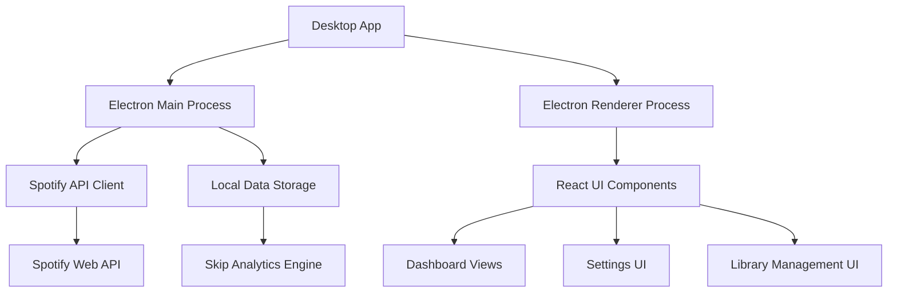
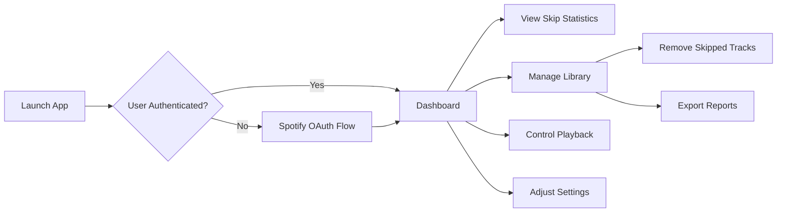

# 1. Title: PRD for Spotify Skip Tracker

<version>1.0.0</version>

## Status: Approved

## Intro

Spotify Skip Tracker is a desktop application that analyzes Spotify listening habits, focusing on identifying frequently skipped songs. It helps users maintain a cleaner music library by providing insights into skip patterns and offering tools to manage their library based on actual listening behavior. The application monitors Spotify playback in real-time, tracks skip patterns, and enables users to make informed decisions about their music collection.

## Goals

- Create a cross-platform desktop application that integrates with Spotify's API to track user listening habits
- Provide real-time monitoring and analytics of skipped tracks to help users identify patterns
- Offer library management tools to automatically or manually remove frequently skipped tracks
- Deliver a comprehensive dashboard with visualizations of listening statistics and skip patterns
- Enable seamless Spotify playback control within the application
- Support customizable thresholds and preferences for skip detection and management

## Features and Requirements

### Functional Requirements

- Real-time Spotify playback monitoring and skip detection
- Skip pattern analysis with customizable thresholds
- Library management tools (remove skipped tracks, auto-unlike)
- Statistics dashboard with visualizations
- Spotify playback control integration
- User authentication with Spotify accounts
- Settings for customizing app behavior

### Non-functional Requirements

- Cross-platform support (Windows, macOS, Linux)
- Modern, responsive UI with light and dark themes
- Secure authentication using OAuth
- Minimal resource usage when running in background
- Offline functionality for viewing past statistics

### User Experience Requirements

- Intuitive, clean interface that's easy to navigate
- Responsive design with smooth transitions
- Clear visualization of complex statistical data
- One-click actions for common tasks (e.g., remove skipped tracks)
- Customizable display preferences

### Integration Requirements

- Spotify Web API integration for user authentication and data retrieval
- Local data storage for offline access to statistics
- Desktop notifications for important events or insights

### Compliance Requirements

- Adherence to Spotify API usage guidelines and rate limits
- Privacy-focused design with transparent data handling
- Compliance with relevant data protection regulations

## Epic List

### Epic-1: Core Application Setup

Focus on the Electron/React foundation, project structure, and build pipeline.
Status: Complete

### Epic-2: Spotify Integration

Implement authentication, real-time playback monitoring, and API interactions.
Status: Complete

### Epic-3: Analytics & Skip Tracking

Develop the core skip detection algorithm and analytics features.
Status: Complete

### Epic-4: User Interface

Create the main application UI, dashboard, and visualization components.
Status: In Progress

### Epic-5: Library Management

Implement tools for managing library based on skip data.
Status: Not Started

### Epic-N: Future Enhancements

Advanced analytics, mobile companion app, social sharing features.
Status: Not Started

## Epic 1: Story List

- Story 1: Project Setup
  Status: 'Complete'
  Requirements:
  - Initialize Electron/React application with TypeScript
  - Configure build and development pipelines
  - Set up project structure following best practices
  - Implement basic window management

- Story 2: Application Settings Framework
  Status: 'Complete'
  Requirements:
  - Create settings storage mechanism
  - Implement settings UI component
  - Add configuration options for app behavior
  - Ensure settings persistence between sessions

## Epic 2: Story List

- Story 3: Authentication Framework
  Status: 'Complete'
  Requirements:
  - Implement secure credential storage
  - Create authentication flow UI
  - Add session management
  - Set up refresh token handling

- Story 4: Playback Monitoring and Skip Detection
  Status: 'Complete'
  Requirements:
  - Implement playback polling service
  - Create track change detection algorithm
  - Add skip analysis logic with position-based detection
  - Develop monitoring controls and status indicators

## Epic 3: Story List

- Story 5: Skip Data Collection and Analysis
  Status: 'Complete'
  Requirements:
  - Enhance skip data model with detailed classification
  - Implement skip data aggregation and statistical analysis
  - Create skip analysis engine for pattern recognition
  - Develop data export functionality for portability
  - Prepare data structures for visualization

## Epic 4: Story List

- Story 6: Dashboard Implementation
  Status: 'Not Started'
  Requirements:
  - Create main dashboard layout with responsive grid system
  - Implement overview panels for key statistics
  - Develop navigation and layout structure
  - Add data refresh mechanisms and loading states
  - Implement theme-aware design with dark/light mode support

- Story 7: Statistics Visualization Components
  Status: 'Not Started'
  Requirements:
  - Implement chart components for skip pattern visualization
  - Create interactive graphs for time-based statistics
  - Build artist and track comparison visualizations
  - Develop responsive visualization components that adapt to screen size
  - Add tooltips and interactive elements for detailed data exploration

- Story 8: User Preferences Interface
  Status: 'Not Started'
  Requirements:
  - Build interface for customizing dashboard layout
  - Implement theme customization controls
  - Create visualization preference settings
  - Develop user-specific data filtering options
  - Add user profile and account settings interface

- Story 9: Real-time Monitoring Interface
  Status: 'Not Started'
  Requirements:
  - Develop live playback monitoring component with player controls
  - Create real-time skip detection visualization
  - Implement session tracking interface
  - Build notification system for significant events
  - Add system tray/menu bar integration for background operation

- Story 10: Interactive Data Explorer
  Status: 'Not Started'
  Requirements:
  - Create advanced filtering and search functionality for statistics
  - Implement data drill-down capabilities for exploring patterns
  - Build comparison views for different time periods
  - Develop exportable report interfaces
  - Add bookmarking for saved views and filters

## Technology Stack

| Technology      | Description                                   |
| --------------- | --------------------------------------------- |
| Electron        | Cross-platform desktop application framework  |
| React           | UI library for building the user interface    |
| TypeScript      | Programming language for type-safe JavaScript |
| Vite            | Build tool and development server             |
| Tailwind CSS    | Utility-first CSS framework for styling       |
| Radix UI        | Accessible component primitives               |
| Recharts        | Charting library for data visualization       |
| Spotify Web API | API for Spotify integration                   |
| Electron Store  | Persistent storage for application data       |
| Vitest          | Testing framework                             |

## Reference

### System Architecture



### User Flow



## Data Models, API Specs, Schemas, etc

### Track Skip Data Schema

```json
{
  "track_id": "string",
  "track_name": "string",
  "artist_name": "string",
  "album_name": "string",
  "skip_timestamp": "datetime",
  "play_duration_ms": "number",
  "track_duration_ms": "number",
  "skip_percentage": "number",
  "context": {
    "type": "string",
    "source": "string",
    "device_id": "string"
  }
}
```

### Settings Schema

```json
{
  "skipDetection": {
    "thresholdPercentage": "number",
    "minimumSkips": "number"
  },
  "libraryManagement": {
    "autoRemove": "boolean",
    "analysisTimeframe": "string"
  },
  "userInterface": {
    "theme": "string",
    "chartColors": "string[]"
  },
  "spotify": {
    "clientId": "string",
    "refreshToken": "string"
  }
}
```

## Project Structure

```text
Spotify-Skip-Tracker
├── config
│   └── eslint.config.mjs
├── docs
├── src
│   ├── assets
│   │   ├── fonts
│   │   │   ├── geist
│   │   │   │   └── geist.ttf
│   │   │   ├── geist-mono
│   │   │   │   └── geist-mono.ttf
│   │   │   └── tomorrow
│   │   │       ├── tomorrow-bold-italic.ttf
│   │   │       ├── tomorrow-bold.ttf
│   │   │       ├── tomorrow-italic.ttf
│   │   │       └── tomorrow-regular.ttf
│   │   ├── SpotifySkipTrackerIconTransparent.icns
│   │   ├── SpotifySkipTrackerIconTransparent.ico
│   │   └── SpotifySkipTrackerIconTransparent.png
│   ├── components
│   │   ├── settings
│   │   │   ├── ApiCredentialsForm.tsx
│   │   │   ├── ApplicationSettingsForm.tsx
│   │   │   ├── ImportExportSettings.tsx
│   │   │   ├── ResetSettingsDialog.tsx
│   │   │   ├── RestartDialog.tsx
│   │   │   ├── settingsFormSchema.ts
│   │   │   └── SkipDetectionForm.tsx
│   │   ├── skippedTracks
│   │   │   ├── dialogs
│   │   │   │   ├── ClearDataDialog.tsx
│   │   │   │   └── RemoveHighlightedDialog.tsx
│   │   │   ├── SkippedTrackRow.tsx
│   │   │   ├── SkippedTracksBulkActions.tsx
│   │   │   ├── SkippedTracksHeader.tsx
│   │   │   ├── SkippedTracksTable.tsx
│   │   │   ├── TrackActionsMenu.tsx
│   │   │   └── utils.ts
│   │   ├── spotify
│   │   │   ├── AuthenticationCard.tsx
│   │   │   ├── LogsCard.tsx
│   │   │   ├── NowPlayingCard.tsx
│   │   │   └── PlaybackMonitoringCard.tsx
│   │   ├── statistics
│   │   │   ├── ArtistsTab.tsx
│   │   │   ├── ClearStatisticsDialog.tsx
│   │   │   ├── DevicesTab.tsx
│   │   │   ├── index.ts
│   │   │   ├── ListeningPatternsTab.tsx
│   │   │   ├── NoDataMessage.tsx
│   │   │   ├── OverviewTab.tsx
│   │   │   ├── SessionsTab.tsx
│   │   │   ├── SkipPatternsTab.tsx
│   │   │   ├── TimeAnalyticsTab.tsx
│   │   │   ├── TracksTab.tsx
│   │   │   └── utils.ts
│   │   ├── ui
│   │   │   ├── alert-dialog.tsx
│   │   │   ├── badge.tsx
│   │   │   ├── button.tsx
│   │   │   ├── card.tsx
│   │   │   ├── chart.tsx
│   │   │   ├── collapsible.tsx
│   │   │   ├── dropdown-menu.tsx
│   │   │   ├── form.tsx
│   │   │   ├── input.tsx
│   │   │   ├── label.tsx
│   │   │   ├── navigation-menu.tsx
│   │   │   ├── progress.tsx
│   │   │   ├── scroll-area.tsx
│   │   │   ├── select.tsx
│   │   │   ├── separator.tsx
│   │   │   ├── skeleton.tsx
│   │   │   ├── slider.tsx
│   │   │   ├── sonner.tsx
│   │   │   ├── spinner.tsx
│   │   │   ├── switch.tsx
│   │   │   ├── table.tsx
│   │   │   ├── tabs.tsx
│   │   │   ├── toggle-group.tsx
│   │   │   ├── toggle.tsx
│   │   │   └── tooltip.tsx
│   │   ├── DragWindowRegion.tsx
│   │   └── ToggleTheme.tsx
│   ├── electron
│   │   ├── main
│   │   │   ├── extensions.ts
│   │   │   ├── installer-events.ts
│   │   │   ├── spotify-ipc.ts
│   │   │   ├── statistics-setup.ts
│   │   │   └── window.ts
│   │   └── main.ts
│   ├── helpers
│   │   ├── ipc
│   │   │   ├── theme
│   │   │   │   ├── theme-channels.ts
│   │   │   │   ├── theme-context.ts
│   │   │   │   └── theme-listeners.ts
│   │   │   ├── window
│   │   │   │   ├── window-channels.ts
│   │   │   │   ├── window-context.ts
│   │   │   │   └── window-listeners.ts
│   │   │   ├── context-exposer.ts
│   │   │   └── listeners-register.ts
│   │   ├── storage
│   │   │   ├── logs-store.ts
│   │   │   ├── settings-store.ts
│   │   │   ├── statistics-store.ts
│   │   │   ├── store.ts
│   │   │   ├── tracks-store.ts
│   │   │   └── utils.ts
│   │   ├── theme_helpers.ts
│   │   └── window_helpers.ts
│   ├── layouts
│   │   └── MainLayout.tsx
│   ├── pages
│   │   ├── HomePage.tsx
│   │   ├── SettingsPage.tsx
│   │   ├── SkippedTracksPage.tsx
│   │   └── StatisticsPage.tsx
│   ├── renderer
│   │   └── preload
│   │       └── preload.ts
│   ├── routes
│   │   ├── __root.tsx
│   │   ├── router.tsx
│   │   └── routes.tsx
│   ├── services
│   │   ├── auth
│   │   │   ├── storage
│   │   │   │   ├── index.ts
│   │   │   │   ├── token-init.ts
│   │   │   │   ├── token-operations.ts
│   │   │   │   ├── token-refresh.ts
│   │   │   │   ├── token-state.ts
│   │   │   │   ├── token-storage.ts
│   │   │   │   └── token-store.ts
│   │   │   ├── index.ts
│   │   │   ├── oauth.ts
│   │   │   ├── server.ts
│   │   │   ├── session.ts
│   │   │   └── window.ts
│   │   ├── playback
│   │   │   ├── history.ts
│   │   │   ├── index.ts
│   │   │   ├── monitor.ts
│   │   │   ├── skip-detection.ts
│   │   │   ├── state.ts
│   │   │   └── track-change.ts
│   │   ├── spotify
│   │   │   ├── auth.ts
│   │   │   ├── constants.ts
│   │   │   ├── credentials.ts
│   │   │   ├── index.ts
│   │   │   ├── interceptors.ts
│   │   │   ├── library.ts
│   │   │   ├── playback.ts
│   │   │   ├── token.ts
│   │   │   └── user.ts
│   │   ├── statistics
│   │   │   ├── aggregator.ts
│   │   │   ├── collector.ts
│   │   │   └── pattern-detector.ts
│   │   ├── api-retry.ts
│   │   ├── spotify.service.ts
│   │   └── token-storage.ts
│   ├── styles
│   │   └── global.css
│   ├── tests
│   │   └── unit
│   │       ├── components
│   │       │   └── ToggleTheme.test.tsx
│   │       ├── helpers
│   │       │   └── storage.test.ts
│   │       ├── services
│   │       │   ├── playback.test.ts
│   │       │   └── spotify.service.test.ts
│   │       └── setup.ts
│   ├── types
│   │   ├── auth.ts
│   │   ├── logging.ts
│   │   ├── playback.ts
│   │   ├── settings.ts
│   │   ├── spotify-api.ts
│   │   ├── spotify.ts
│   │   ├── statistics.ts
│   │   ├── theme-mode.ts
│   │   └── token.ts
│   ├── utils
│   │   └── tailwind.ts
│   ├── App.tsx
│   ├── global.d.ts
│   ├── main.ts
│   ├── modules.d.ts
│   ├── preload.ts
│   ├── renderer.ts
│   └── types.d.ts
├── vite-config
│   ├── vite.base.config.ts
│   ├── vite.main.config.ts
│   ├── vite.preload.config.ts
│   ├── vite.renderer.config.ts
│   └── vitest.config.ts
├── components.json
├── forge.config.ts
├── forge.env.d.ts
├── index.html
├── LICENSE
├── package-lock.json
├── package.json
├── postcss.config.ts
├── README.md
└── tsconfig.json
```

## Change Log

| Change               | Story ID     | Description                                             |
| -------------------- | ------------ | ------------------------------------------------------- |
| Initial draft        | N/A          | Initial draft PRD                                       |
| Project structure    | Story-1      | Defined project architecture and file organization      |
| Settings framework   | Story-2      | Added application settings and persistence              |
| Epic-1 Complete      | Stories 1-2  | Completed Core Application Setup epic                   |
| Authentication       | Story-3      | Implemented Spotify authentication and token management |
| Playback monitoring  | Story-4      | Added real-time playback tracking and skip detection    |
| Epic-2 Complete      | Stories 3-4  | Completed Spotify Integration epic                      |
| Skip data collection | Story-5      | Implemented data collection and statistical analysis    |
| Data export          | Story-5      | Added multi-format export capabilities                  |
| Epic-3 Complete      | Story-5      | Completed Analytics & Skip Tracking epic                |
| Epic-4 Planning      | Stories 6-10 | Added detailed stories for User Interface epic          |
