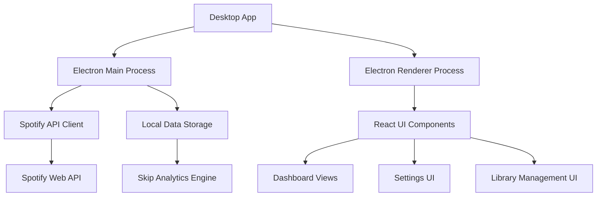
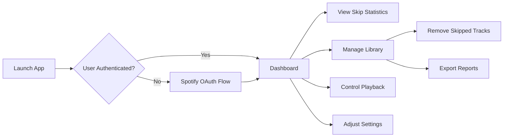

# 1. Title: PRD for Spotify Skip Tracker

<version>1.0.0</version>

## Status: Approved

## Intro

Spotify Skip Tracker is a desktop application that analyzes Spotify listening habits, focusing on identifying frequently skipped songs. It helps users maintain a cleaner music library by providing insights into skip patterns and offering tools to manage their library based on actual listening behavior. The application monitors Spotify playback in real-time, tracks skip patterns, and enables users to make informed decisions about their music collection.

## Goals

- Create a cross-platform desktop application that integrates with Spotify's API to track user listening habits
- Provide real-time monitoring and analytics of skipped tracks to help users identify patterns
- Offer library management tools to automatically or manually remove frequently skipped tracks
- Deliver a comprehensive dashboard with visualizations of listening statistics and skip patterns
- Enable seamless Spotify playback control within the application
- Support customizable thresholds and preferences for skip detection and management

## Features and Requirements

### Functional Requirements

- Real-time Spotify playback monitoring and skip detection
- Skip pattern analysis with customizable thresholds
- Library management tools (remove skipped tracks, auto-unlike)
- Statistics dashboard with visualizations
- Spotify playback control integration
- User authentication with Spotify accounts
- Settings for customizing app behavior

### Non-functional Requirements

- Cross-platform support (Windows, macOS, Linux)
- Modern, responsive UI with light and dark themes
- Secure authentication using OAuth
- Minimal resource usage when running in background
- Offline functionality for viewing past statistics

### User Experience Requirements

- Intuitive, clean interface that's easy to navigate
- Responsive design with smooth transitions
- Clear visualization of complex statistical data
- One-click actions for common tasks (e.g., remove skipped tracks)
- Customizable display preferences

### Integration Requirements

- Spotify Web API integration for user authentication and data retrieval
- Local data storage for offline access to statistics
- Desktop notifications for important events or insights

### Compliance Requirements

- Adherence to Spotify API usage guidelines and rate limits
- Privacy-focused design with transparent data handling
- Compliance with relevant data protection regulations

## Epic List

### Epic-1: Core Application Setup

Focus on the Electron/React foundation, project structure, and build pipeline.

### Epic-2: Spotify Integration

Implement authentication, real-time playback monitoring, and API interactions.

### Epic-3: Analytics & Skip Tracking

Develop the core skip detection algorithm and analytics features.

### Epic-4: User Interface

Create the main application UI, dashboard, and visualization components.

### Epic-5: Library Management

Implement tools for managing library based on skip data.

### Epic-N: Future Enhancements

Advanced analytics, mobile companion app, social sharing features.

## Epic 1: Story List

- Story 1: Project Setup
  Status: ''
  Requirements:

  - Initialize Electron/React application with TypeScript
  - Configure build and development pipelines
  - Set up project structure following best practices
  - Implement basic window management

- Story 2: Application Settings Framework
  Status: ''
  Requirements:

  - Create settings storage mechanism
  - Implement settings UI component
  - Add configuration options for app behavior
  - Ensure settings persistence between sessions

- Story 3: Authentication Framework
  Status: ''
  Requirements:
  - Implement secure credential storage
  - Create authentication flow UI
  - Add session management
  - Set up refresh token handling

## Technology Stack

| Technology      | Description                                   |
| --------------- | --------------------------------------------- |
| Electron        | Cross-platform desktop application framework  |
| React           | UI library for building the user interface    |
| TypeScript      | Programming language for type-safe JavaScript |
| Vite            | Build tool and development server             |
| Tailwind CSS    | Utility-first CSS framework for styling       |
| Radix UI        | Accessible component primitives               |
| Recharts        | Charting library for data visualization       |
| Spotify Web API | API for Spotify integration                   |
| Electron Store  | Persistent storage for application data       |
| Vitest          | Testing framework                             |

## Reference

### System Architecture



### User Flow



## Data Models, API Specs, Schemas, etc

### Track Skip Data Schema

```json
{
  "track_id": "string",
  "track_name": "string",
  "artist_name": "string",
  "album_name": "string",
  "skip_timestamp": "datetime",
  "play_duration_ms": "number",
  "track_duration_ms": "number",
  "skip_percentage": "number",
  "context": {
    "type": "string",
    "source": "string",
    "device_id": "string"
  }
}
```

### Settings Schema

```json
{
  "skipDetection": {
    "thresholdPercentage": "number",
    "minimumSkips": "number"
  },
  "libraryManagement": {
    "autoRemove": "boolean",
    "analysisTimeframe": "string"
  },
  "userInterface": {
    "theme": "string",
    "chartColors": "string[]"
  },
  "spotify": {
    "clientId": "string",
    "refreshToken": "string"
  }
}
```

## Project Structure

```text
spotify-skip-tracker/
├── src/
│   ├── assets/              # Static assets and images
│   ├── components/          # Reusable UI components
│   │   ├── ui/              # shadcn components (Radix UI + Tailwind)
│   │   ├── statistics/      # Components for visualization and statistics
│   │   ├── skippedTracks/   # Components for skipped tracks display
│   │   ├── spotify/         # Spotify-specific UI components
│   │   └── settings/        # Settings form components
│   │
│   ├── electron/            # Electron-specific code
│   │   ├── main/            # Main process modules
│   │   │   ├── spotify-ipc.ts     # IPC handlers for Spotify API
│   │   │   ├── window.ts          # Window management
│   │   │   ├── extensions.ts      # Dev extensions installer
│   │   │   └── installer-events.ts # Windows installer handlers
│   │   └── main.ts          # Main process entry point
│   │
│   ├── helpers/             # Helper utilities
│   │
│   ├── layouts/             # Page layout components
│   │   └── MainLayout.tsx   # Primary application layout
│   │
│   ├── pages/               # Page components (route destinations)
│   │   ├── HomePage.tsx          # Dashboard/main view
│   │   ├── SkippedTracksPage.tsx # Skipped tracks list view
│   │   ├── StatisticsPage.tsx    # Statistics and charts view
│   │   └── SettingsPage.tsx      # Application settings view
│   │
│   ├── routes/              # Routing configuration
│   │   ├── routes.tsx       # Route definitions
│   │   ├── router.tsx       # Router setup
│   │   └── __root.tsx       # Root layout wrapper
│   │
│   ├── services/            # API and business logic services
│   │   ├── auth/            # Authentication services
│   │   ├── playback/        # Playback monitoring modules
│   │   │   ├── monitor.ts       # Playback monitoring logic
│   │   │   ├── track-change.ts  # Track change detection
│   │   │   ├── state.ts         # Playback state management
│   │   │   ├── history.ts       # Playback history tracking
│   │   │   └── index.ts         # Service exports
│   │   ├── spotify/         # Spotify API integration
│   │   ├── spotify.service.ts # Renderer-side Spotify service
│   │   ├── token-storage.ts # Token management service
│   │   └── api-retry.ts     # API retry logic
│   │
│   ├── styles/              # Global styles and Tailwind config
│   │
│   ├── tests/               # Test files
│   │
│   ├── types/               # TypeScript type definitions
│   │
│   ├── utils/               # Utility functions
│   │
│   ├── App.tsx              # Main React component
│   ├── main.ts              # Application entry point
│   ├── preload.ts           # Electron preload script
│   ├── renderer.ts          # Renderer process entry point
│   └── types.d.ts           # Global type definitions
│
├── vite-config/            # Vite configuration files
├── config/                 # Project configuration files
├── test-results/           # Test results output
└── public/                 # Static public assets
```

## Change Log

| Change        | Story ID | Description       |
| ------------- | -------- | ----------------- |
| Initial draft | N/A      | Initial draft PRD |
