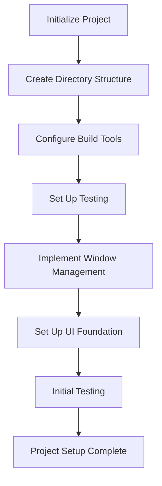

# Epic-1 - Story-1

# Project Setup and Development Environment Configuration

**As a** developer
**I want** to set up the Spotify Skip Tracker project with proper configurations and dependencies
**so that** I can build and develop the application efficiently

## Status

Complete

## Context

This is the initial story for the Spotify Skip Tracker project. It focuses on setting up the development environment, project structure, and build configuration. This will establish the foundation for all subsequent development tasks.

The application is a cross-platform desktop application built with Electron and React that will track Spotify listening habits and analyze skip patterns.

## Estimation

Story Points: 2

## Tasks

1. - [x] Initialize Project Structure

   1. - [x] Create directory structure as defined in the architecture document
   2. - [x] Set up TypeScript configuration
   3. - [x] Configure ESLint and Prettier for code quality
   4. - [x] Set up Git repository with appropriate .gitignore

2. - [x] Configure Build System

   1. - [x] Set up Vite for development and build
   2. - [x] Configure Electron Forge for packaging
   3. - [x] Create npm scripts for development workflows
   4. - [x] Configure hot reloading for development

3. - [x] Set Up Testing Framework

   1. - [x] Install and configure Vitest
   2. - [x] Set up React Testing Library
   3. - [x] Create initial test structure

4. - [x] Implement Basic Window Management

   1. - [x] Create main process entry point
   2. - [x] Set up basic window creation
   3. - [x] Configure preload scripts
   4. - [x] Implement basic IPC communication setup

5. - [x] Initialize UI Foundation
   1. - [x] Set up Tailwind CSS
   2. - [x] Install and configure shadcn/ui components
   3. - [x] Create basic layout structure
   4. - [x] Set up theme support (light/dark)

## Constraints

- The application must be cross-platform compatible (Windows, macOS, Linux)
- Build processes should be optimized for development speed and production performance
- Follow best practices for Electron security

## Data Models / Schema

N/A for initial setup

## Structure

Following the structure defined in the architecture document:

```text
Spotify-Skip-Tracker
├── config
│   └── eslint.config.mjs
├── src
│   ├── assets
│   │   ├── SpotifySkipTrackerIconTransparent.icns
│   │   ├── SpotifySkipTrackerIconTransparent.ico
│   │   └── SpotifySkipTrackerIconTransparent.png
│   ├── components
│   │   ├── ui
│   │   │   ├── button.tsx
│   │   │   ├── card.tsx
│   │   │   ├── form.tsx
│   │   │   ├── input.tsx
│   │   │   └── ... other UI components
│   │   └── ToggleTheme.tsx
│   ├── electron
│   │   ├── main
│   │   │   ├── extensions.ts
│   │   │   ├── installer-events.ts
│   │   │   └── window.ts
│   │   └── main.ts
│   ├── layouts
│   │   └── MainLayout.tsx
│   ├── pages
│   │   └── HomePage.tsx
│   ├── routes
│   │   ├── __root.tsx
│   │   ├── router.tsx
│   │   └── routes.tsx
│   ├── styles
│   │   └── global.css
│   ├── tests
│   │   └── unit
│   │       └── setup.ts
│   ├── types
│   ├── utils
│   │   └── tailwind.ts
│   ├── App.tsx
│   ├── main.ts
│   ├── preload.ts
│   ├── renderer.ts
│   └── types.d.ts
├── vite-config
│   ├── vite.base.config.ts
│   ├── vite.main.config.ts
│   ├── vite.preload.config.ts
│   ├── vite.renderer.config.ts
│   └── vitest.config.ts
├── components.json
├── forge.config.ts
├── index.html
├── package.json
├── postcss.config.ts
├── README.md
└── tsconfig.json
```

## Diagrams



## Dev Notes

- Focus on maintainable configuration that can scale with the project
- Ensure proper separation between main and renderer processes
- Consider developer experience in all setup decisions
- Implement proper error handling from the beginning

## Chat Command Log

- Initial project setup request
