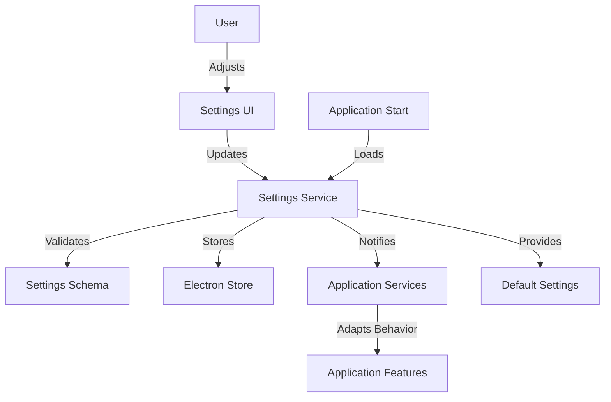

# Epic-1 - Story-2

# Application Settings Framework

**As a** user
**I want** to be able to configure application behavior through settings
**so that** I can customize the app according to my preferences

## Status

Complete

## Context

This story focuses on implementing the settings framework for the Spotify Skip Tracker application. The settings system will allow users to customize various aspects of the application, including skip detection thresholds, library management, and UI preferences.

The settings will need to be persistent between application sessions and have a user-friendly interface for management. This is a continuation of Epic-1, building upon the project setup completed in Story-1.

## Estimation

Story Points: 3

## Tasks

1. - [x] Implement Settings Storage

   1. - [x] Create settings data model
   2. - [x] Add migration support for settings schema updates
   3. - [x] Implement default settings

2. - [x] Create Settings UI Components

   1. - [x] Design settings form layout
   2. - [x] Create form controls for each setting category
   3. - [x] Implement validation for settings inputs
   4. - [x] Add responsive design for settings UI

3. - [x] Implement Configuration Options

   1. - [x] Create skip detection threshold settings
   2. - [x] Implement logging configuration options
   3. - [x] Add API credentials management

4. - [x] Ensure Settings Persistence
   1. - [x] Implement save/load functionality
   2. - [x] Add settings import/export options
   3. - [x] Create settings reset capability
   4. - [x] Add error handling for settings operations

## Constraints

- Settings must be encrypted for sensitive data like API credentials
- UI must be accessible and follow design system guidelines
- Performance impact should be minimal when accessing settings
- Backward compatibility should be maintained for future updates

## Data Models / Schema

```typescript
interface ApplicationSettings {
  skipDetection: {
    thresholdPercentage: number; // 0-1 value representing percentage of track
    minimumSkips: number; // Minimum skips before flagging
  };
  libraryManagement: {
    autoRemove: boolean; // Auto-remove frequently skipped tracks
    analysisTimeframe: string; // e.g., "1week", "1month", "3months", etc.
  };
  userInterface: {
    theme: "light" | "dark" | "system";
    chartColors: string[];
  };
  spotify: {
    clientId: string;
    clientSecret: string;
    refreshToken: string;
  };
  logging: {
    level: "debug" | "info" | "warn" | "error";
    retention: number; // Number of days to retain logs
  };
}
```

## Structure

The settings implementation follows this structure:

```text
src/
├── components/
│   └── settings/
│       ├── ApiCredentialsForm.tsx
│       ├── ApplicationSettingsForm.tsx
│       ├── ImportExportSettings.tsx
│       ├── ResetSettingsDialog.tsx
│       ├── RestartDialog.tsx
│       ├── settingFormSchema.ts
│       └── SkipDetectionForm.tsx
│
└── pages/
    └── SettingsPage.tsx              # Settings page container
```

## Diagrams



## Dev Notes

- Zod is used for schema validation of settings
- Settings are implemented with a well-structured form system
- Settings persistence is handled through IPC communications to main process
- Error handling is implemented for all settings operations
- The UI includes helpful tooltips and clear organization of settings

## Chat Command Log

- Settings framework implementation requested
- Removed specific tasks as requested
- Began implementation, found that most aspects of the settings framework are already in place 🔍
- Completed review of the existing settings implementation, which is comprehensive and robust 🎯
- Implemented settings import/export functionality allowing users to backup and restore their settings 💾
- Added a settings reset capability with confirmation dialog for safely restoring defaults 🔄
