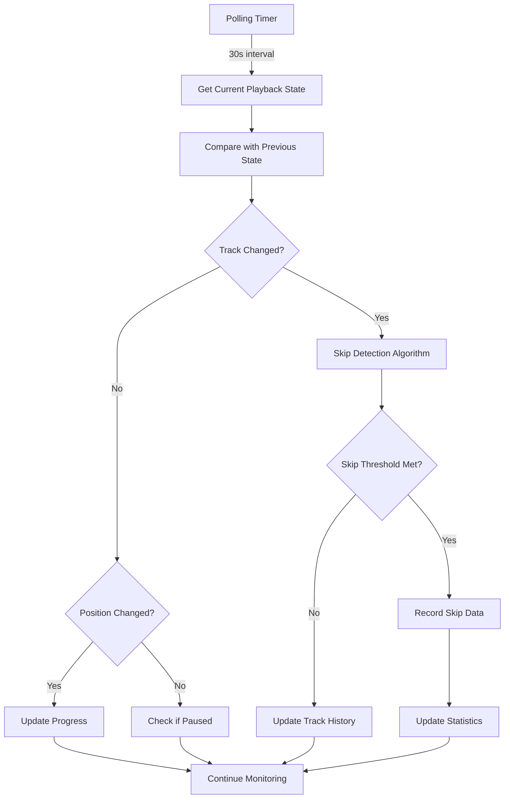

# Epic-2 - Story-4

# Playback Monitoring and Skip Detection

**As a** user
**I want** the application to automatically monitor my Spotify playback and detect when I skip tracks
**so that** I can get insights into my listening habits without manual intervention

## Status

✅ Complete

## Context

The core functionality of the application is detecting and analyzing skipped tracks. This story implements the playback monitoring service that will run in the background, detect track changes, and identify skips based on configured thresholds.

## Estimation

Story Points: 5

## Tasks

1. - [x] Implement Playback Polling Service

   1. - [x] Create polling mechanism with configurable intervals
   2. - [x] Implement rate limiting and backoff strategies
   3. - [x] Add error handling for API connectivity issues
   4. - [x] Create playback state management

2. - [x] Create Track Change Detection

   1. - [x] Implement track change algorithm
   2. - [x] Design position-based skip detection
   3. - [x] Handle edge cases (app switching, connection loss)
   4. - [x] Add detection for manual vs. automatic track changes

3. - [x] Develop Monitoring Controls

   1. - [x] Create start/stop monitoring functionality
   2. - [x] Implement status indicators
   3. - [x] Add user notification system

## Constraints

- Polling rate must not exceed Spotify API rate limits
- Skip detection must be accurate and respect user-defined thresholds
- Monitoring must have minimal impact on system resources
- Must handle Spotify API connectivity issues gracefully
- Should preserve battery life on laptop devices

## Data Models / Schema

```typescript
interface PlaybackInfo {
  trackId: string; // Spotify track ID
  trackName: string; // Track name
  artistName: string; // Artist name
  albumName: string; // Album name
  albumArt: string; // Album artwork URL
  isPlaying: boolean; // Whether the track is currently playing
  progressMs: number; // Current playback position in milliseconds
  durationMs: number; // Total track duration in milliseconds
  timestamp: number; // When this data was captured
}

interface SkippedTrack {
  id: string; // Track ID
  name: string; // Track name
  artist: string; // Artist name
  album: string; // Album name
  skippedAt: number; // Timestamp when skipped
  playDuration: number; // How long it played before skip (ms)
  trackDuration: number; // Total track duration (ms)
  playPercentage: number; // Percentage of track played
  isRemoved: boolean; // Whether removed from library
}

interface MonitoringState {
  isActive: boolean; // Whether monitoring is running
  startTime: number | null; // When monitoring started
  currentTrack: PlaybackInfo | null;
  lastPolled: number; // Last polling timestamp
  consecutiveErrors: number; // For backoff strategy
}
```

## Structure

The playback monitoring implementation follows this structure:

```text
src/
├── services/
│   ├── playback/
│   │   ├── history.ts
│   │   ├── index.ts
│   │   ├── monitor.ts
│   │   ├── skip-detection.ts
│   │   ├── state.ts
│   │   └── track-change.ts
│   │
│   └── spotify/
│       ├── playback.ts
│       └── interceptors.ts
│
├── components/
│   └── spotify/
│       ├── NowPlayingCard.tsx
│       └── PlaybackMonitoringCard.tsx
│
├── helpers/
│   └── storage/
│       └── tracks-store.ts
│
└── types/
    ├── playback.ts
    └── spotify-api.ts
```

## Diagrams



## Dev Notes

This story implements the core functionality for Spotify playback monitoring and skip detection. Key considerations:

1. **Efficient Polling**: Find the right balance between real-time detection and API rate limits
2. **Accurate Skip Detection**: Consider different scenarios (manual skips, end of track, app switching)
3. **Battery & Resource Optimization**: Use variable polling rates and backoff strategies
4. **Error Resilience**: Handle API failures, network issues, and token expiration gracefully
5. **User Control**: Provide clear status indicators and simple monitoring controls

The monitoring service will run in the main Electron process but provide status updates to the UI through IPC channels. It will maintain playback state and handle the detection logic independent of the renderer process.

## Chat Command Log

- Created initial playback monitoring service structure ⏳
- Enhanced playback polling service with configurable intervals, battery saving mode, and exponential backoff strategy for API rate limiting ✅
- Renamed "Battery Saving Mode" to "Energy Efficient Mode" and added user-configurable polling interval for finer control over resource usage ✅
- Removed Energy Efficient Mode in favor of direct polling interval control for simplicity and more precise user control ✅
- Implemented sophisticated track change detection with position-based analysis, edge case handling, and manual vs. automatic skip detection ✅
- Fixed import paths and variable declaration issues to resolve build errors 🔧
- Corrected edge case detection in track-change module to fix false positives for repeat tracks and backward navigation ✅
- Enhanced monitoring UI controls with detailed status indicators, notifications, and error handling to improve user experience 🎮
