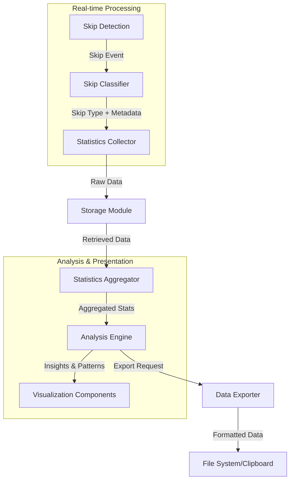

# Epic-3 - Story-5

# Skip Data Collection and Analysis

**As a** user
**I want** the application to collect and analyze data about my skipped tracks
**so that** I can understand my listening patterns and make informed decisions about my music library

## Status

✅ Completed

## Context

Now that the core monitoring infrastructure and skip detection are in place, this story focuses on collecting, storing, and analyzing skip data. This includes aggregating skip statistics, creating metrics, and preparing the data for visualization and insights.

## Estimation

Story Points: 4

## Tasks

1. - [x] Enhance Skip Data Model

   1. - [x] Add detailed skip classification (quick preview, standard, near end)
   2. - [x] Implement manual vs. automatic skip detection
   3. - [x] Create listening context data (playlist, album, radio)
   4. - [x] Add time-of-day and skip pattern metadata

2. - [x] Implement Skip Data Aggregation

   1. - [x] Create daily and weekly skip metrics
   2. - [x] Add artist and genre-level aggregation
   3. - [x] Implement time-based pattern detection
   4. - [x] Calculate library-wide skip statistics

3. - [x] Create Skip Analysis Engine

   1. - [x] Set up aggregation and analysis services
   2. - [x] Implement skip pattern detection
   3. - [x] Store statistical data in statistics subfolder
   4. - [x] Calculate artist-level insights
   5. - [x] Add interactive chart visualization

4. - [x] Develop Data Export Functionality
   1. - [x] Create CSV export capability
   2. - [x] Add JSON data export
   3. - [x] Implement clipboard copy for statistics
   4. - [x] Create data backup and restore mechanism

## Constraints

- Analysis must be performant even with large datasets
- Skip thresholds should be configurable by users
- Privacy considerations must be respected
- Data structures should support future visualization requirements
- Storage format must be backward compatible with future updates

## Data Models / Schema

```typescript
// Enhanced Skip Types
enum SkipType {
  PREVIEW = "preview", // Quick preview (< 20%)
  STANDARD = "standard", // Normal skip (20-80%)
  NEAR_END = "near_end", // Near completion (> 80%)
  AUTO = "auto", // Automatic (end of track)
  MANUAL = "manual", // User-initiated
}

// Skip metrics for analysis
interface SkipTypeMetrics {
  preview: number; // Count of preview skips
  standard: number; // Count of standard skips
  nearEnd: number; // Count of near-end skips
  auto: number; // Count of automatic skips
  manual: number; // Count of manual skips
  byTimeOfDay: number[]; // Distribution by hour (0-23)
}

// Aggregated statistics
interface SkipStatistics {
  dailySkips: DailyMetrics[]; // Per-day metrics
  artistSkips: Record<string, number>; // Skips by artist
  skipTypeMetrics: SkipTypeMetrics; // Skip types
  skipRatio: number; // Percentage of all tracks skipped
  mostSkippedTime: number; // Hour with most skips
  skipTrends: SkipTrend[]; // Weekly/monthly trends
}

// Daily metrics for time-based analysis
interface DailyMetrics {
  date: string; // ISO date
  totalTracks: number; // Total tracks played
  skippedTracks: number; // Number skipped
  skipsByType?: Record<SkipType, number>; // Skips by type
  hourlyDistribution: number[]; // Skips by hour
}
```

## Structure

The skip data collection and analysis implementation follows this structure:

```text
src/
├── services/
│   ├── statistics/
│   │   ├── aggregator.ts
│   │   ├── collector.ts
│   │   └── pattern-detector.ts
│   │
│   └── playback/
│       └── skip-detection.ts
│
├── components/
│   ├── skippedTracks/
│   │   ├── dialogs/
│   │   │   ├── ClearDataDialog.tsx
│   │   │   └── RemoveHighlightedDialog.tsx
│   │   ├── SkippedTrackRow.tsx
│   │   ├── SkippedTracksBulkActions.tsx
│   │   ├── SkippedTracksHeader.tsx
│   │   ├── SkippedTracksTable.tsx
│   │   ├── TrackActionsMenu.tsx
│   │   └── utils.ts
│   │
│   └── statistics/
│       ├── ArtistsTab.tsx
│       ├── ClearStatisticsDialog.tsx
│       ├── DevicesTab.tsx
│       ├── index.ts
│       ├── ListeningPatternsTab.tsx
│       ├── NoDataMessage.tsx
│       ├── OverviewTab.tsx
│       ├── SessionsTab.tsx
│       ├── SkipPatternsTab.tsx
│       ├── TimeAnalyticsTab.tsx
│       ├── TracksTab.tsx
│       └── utils.ts
│
├── helpers/
│   ├── storage/
│   │   └── statistics-store.ts
│   │
│   └── ipc/
│       └── context-exposer.ts
│
├── pages/
│   ├── SkippedTracksPage.tsx
│   └── StatisticsPage.tsx
│
├── electron/
│   └── main/
│       └── statistics-setup.ts
│
└── types/
    └── statistics.ts
```

## Diagrams



## Dev Notes

This story builds upon the skip detection implemented in Story-4, enhancing it with sophisticated analysis capabilities. Key considerations:

1. **Data Model Enhancement**: Expanding the existing skip tracking to capture richer context and classification
2. **Pattern Recognition**: Implementing algorithms to identify listening patterns and trends
3. **Aggregation Performance**: Ensuring efficient data processing for large datasets
4. **Export Flexibility**: Creating versatile export options for data portability
5. **Visualization Preparation**: Structuring data in ways that will support the upcoming visualization features

The analysis engine should balance complexity with performance, focusing on meaningful patterns while avoiding over-analysis of statistically insignificant data points.

## Command Log

- ✅ Enhanced `SkippedTrack` interface with detailed skip classification properties and support for enhanced metadata storage.
- ✅ Implemented manual vs. automatic skip detection with tracking and analysis capabilities.
- ✅ Added listening context data tracking (playlist, album, radio) to capture where tracks are being skipped.

Skip analytics services have been enhanced to support rich data aggregation in the following ways:

1. **Daily and weekly metrics**: Added functions to aggregate skip data by day and week, providing insights into listening patterns over time.

2. **Artist and genre aggregation**: Implemented artist-level skip metrics to identify which artists have the highest skip rates, including detailed statistics like average play percentage and most skipped tracks per artist.

3. **Time-based pattern detection**: Created analytics for time-of-day and day-of-week skip patterns, identifying peak skip hours globally and per artist.

4. **Library-wide statistics**: Added comprehensive statistics that provide a holistic view of skipping behavior across the entire library, with insights into overall skip rates, most-skipped tracks, and trend visualization.

These aggregation features allow users to understand their listening patterns in detail, with data stored in separate files for easy access by the UI components.

Created foundational skip analysis services to power the analytics engine:

1. **Artist-level aggregation**: Implemented detailed tracking of skip patterns by artist, including skip counts, skip types, and average play percentage.

2. **Time-based pattern analysis**: Added detection of skip patterns by time of day and day of week, identifying peak skip hours both globally and per artist.

3. **Library-wide statistics**: Created comprehensive metrics about the user's entire library, including overall skip rates, most-skipped tracks, and artists with highest skip rates.

4. **IPC bridge for analytics**: Added secure IPC handlers and context bridge to make these analytics functions available to the renderer process.

These services provide the foundation for the skip analysis engine, allowing for rich insights into listening patterns.

Implemented a comprehensive skip pattern detection engine with the following capabilities:

1. **Pattern Detection Service**: Created a new pattern detection service that can identify meaningful patterns in user listening data, such as artist aversion, time-of-day preferences, immediate skips, skip streaks, and context-specific patterns.

2. **Pattern Visualization**: Developed a React-based visualization component that presents detected patterns with confidence scores, occurrence counts, and detailed insights through interactive cards and charts.

3. **Statistical Analysis**: Added sophisticated statistical analysis to calculate pattern confidence scores based on multiple factors, ensuring that only significant patterns are presented to users.

4. **Interactive UI**: Created a tabbed statistics page that allows users to view different aspects of their listening patterns, refresh data, and manage the collection process.

These features enable users to gain deeper insights into their listening behavior by automatically detecting meaningful patterns in their skip data, presented through an intuitive UI with interactive visualizations.

Implemented organized statistics storage by creating a dedicated subfolder structure:

1. **Statistics Directory**: Created a dedicated "statistics" subfolder within the application data directory to organize all statistics-related files.

2. **Consistent Access**: Updated all services to ensure the statistics directory exists before saving files and to use consistent paths when reading/writing data.

3. **Improved Organization**: Moved all statistics files (daily metrics, weekly metrics, artist metrics, library stats, time patterns, detected patterns) to the statistics subfolder for better organization.

4. **Robust Error Handling**: Added error handling to ensure all statistics operations gracefully handle file access issues and prevent data corruption.

Implemented comprehensive data export functionality with multiple export format options:

1. **Export Service**: Created a dedicated export service (`services/statistics/export.ts`) with specialized functions for exporting different types of statistics data.

2. **Multi-format Support**: Implemented support for:

   - CSV exports for all major data types (skipped tracks, artist metrics, daily metrics, weekly metrics, library statistics, time patterns, detected patterns)
   - JSON export for complete dataset backup and portability
   - Clipboard export for easily sharing statistics summaries

3. **IPC Integration**: Extended the Electron IPC layer to securely expose export functionalities to the renderer process, with proper error handling and user feedback.

4. **User Interface**: Created an intuitive ExportDataTab component with separate tabs for different export formats, descriptive cards, and visual feedback during export operations.

5. **Data Backup**: The JSON export provides a complete backup of all statistics data in a structured format that can be used for restoration, data transfer between devices, or external analysis.

The export functionality completes the data collection and analysis workflow by allowing users to extract their statistics in various formats suited to different needs, from simple sharing to comprehensive backups.
