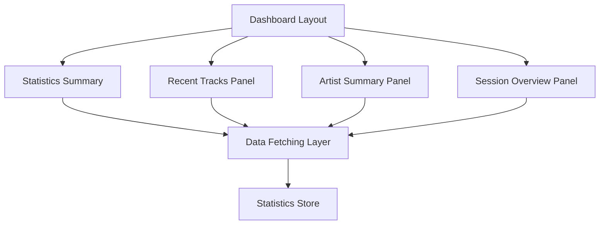

# Epic-4 - Story-6

# Dashboard Implementation

**As a** user of Spotify Skip Tracker
**I want** a comprehensive dashboard that displays my listening statistics
**so that** I can easily understand my track skipping patterns

## Status

Completed

## Context

This story is part of Epic-4 which focuses on creating the user interface for the Spotify Skip Tracker application.

The dashboard is a critical component that will serve as the main interface for users to view their skip statistics, visualize patterns, and access key information at a glance. The dashboard will integrate with the existing skip tracking functionality developed in previous epics and provide a foundation for the detailed visualization components that will be implemented in Story 7.

Previous stories have already implemented the core functionality for Spotify authentication (Story 3), playback monitoring and skip detection (Story 4), and skip data collection and analysis (Story 5). This story will build upon that foundation to create the visual presentation layer.

## Estimation

Story Points: 3

## Tasks

1. - [x] Create Main Dashboard Layout

   1. - [x] Implement responsive grid layout
   2. - [x] Set up layout areas for different statistics panels
   3. - [x] Add navigation structure
   4. - [x] Implement container components for statistics
   5. - [x] Create responsive breakpoints for different screen sizes

2. - [x] Implement Overview Panels

   1. - [x] Create summary statistics panels for key metrics
   2. - [x] Implement recent skipped tracks list
   3. - [x] Add artist summary panel
   4. - [x] Create session overview panel

3. - [x] Develop Data Loading and State Management

   1. - [x] Implement data fetching from statistics store
   2. - [x] Add loading states and placeholders
   3. - [x] Create refresh mechanisms for dynamic updating
   4. - [x] Implement error handling for failed data loading

4. - [x] Implement Theme Support

   1. - [x] Ensure all dashboard components support light/dark themes
   2. - [x] Add theme-aware color scheme
   3. - [x] Test theme switching on all dashboard components

5. - [x] Improve Type System and Refactor Components
   1. - [x] Move DashboardLayout to /src/layouts folder
   2. - [x] Fix "View all skipped tracks" navigation functionality
   3. - [x] Fix the active state in bottom navigation
   4. - [x] Implement auto-refresh for dashboard statistics
   5. - [x] Consolidate type definitions from types.d.ts into global.d.ts
   6. - [x] Fix linter errors and improve type safety

## Constraints

- Must work well on desktop screen sizes (min width 1024px)
- Should maintain performance when displaying large datasets
- All UI components must be accessible and keyboard navigable
- Must support both light and dark themes

## Data Models / Schema

Dashboard will use the existing statistics schema defined in Epic 3:

```typescript
interface SkipStatistics {
  totalTracks: number;
  totalSkips: number;
  averageSkipPercentage: number;
  mostSkippedArtists: Array<{
    artistId: string;
    artistName: string;
    skipCount: number;
  }>;
  mostSkippedTracks: Array<{
    trackId: string;
    trackName: string;
    artistName: string;
    skipCount: number;
  }>;
  recentSessions: Array<{
    sessionId: string;
    date: string;
    trackCount: number;
    skipCount: number;
  }>;
}
```

## Structure

The dashboard components have been refactored and organized as follows:

- `/src/layouts/DashboardLayout.tsx` - Main container component
- `/src/components/dashboard/StatisticsSummary.tsx` - Overview statistics
- `/src/components/dashboard/RecentTracks.tsx` - Recent skipped tracks panel
- `/src/components/dashboard/ArtistSummary.tsx` - Artist statistics panel
- `/src/components/dashboard/SessionOverview.tsx` - Recent sessions panel
- `/src/components/dashboard/index.ts` - Exports all components

## Diagrams



## Dev Notes

- Moved DashboardLayout to `/src/layouts` folder to better organize the application structure
- Removed Card wrappers from individual components to create a cleaner, less nested UI
- Removed quick actions component as it was deemed unnecessary
- Fixed "View all skipped tracks" button to use proper router navigation instead of window.location
- Fixed active state indication in bottom navigation
- Implemented auto-refresh (every second) for dashboard statistics for real-time updates
- Improved type system by consolidating declarations:
  - Merged all type definitions from `types.d.ts` into `global.d.ts`
  - Added proper documentation comments to each interface
  - Organized types with logical grouping and section headers
  - Improved consistency across type definitions
  - Fixed linter errors related to unused declarations
- Added mobile-specific tab interface with reduced number of tabs (from 5 to 4)
- Prioritized responsiveness with improved grid layout for desktop and tabbed mobile interface
- Used existing UI components for consistent styling throughout the dashboard

## Chat Command Log

- User: Continue with working on Epic 4
- Agent: Created Dashboard Layout components (DashboardLayout, StatisticsSummary, RecentTracks, ArtistSummary, SessionOverview, DashboardActions)
- Agent: Updated HomePage to integrate dashboard components with tabbed interface
- User: Fix authentication card visibility on homepage
- Agent: Moved authentication card to top of page to ensure it's always visible
- User: Fix monitoring card's authentication status
- Agent: Added isAuthenticated prop to PlaybackMonitoringCard component
- User: Remove quick actions component and simplify dashboard
- Agent: Removed DashboardActions component and simplified layout
- User: Move DashboardLayout to src/layouts folder
- Agent: Created new DashboardLayout component in src/layouts and updated imports
- User: Fix "View all skipped tracks" button and navigation
- Agent: Updated RecentTracks component to use router navigation instead of window.location
- User: Fix active state in bottom navigation
- Agent: Implemented useMatch hook in MainLayout for proper active route determination
- User: Add auto-refresh for dashboard statistics
- Agent: Added data refresh every second to HomePage for real-time updates
- User: Fix linter errors in HomePage.tsx
- Agent: Fixed type definitions and removed unused functions
- User: Consolidate type definitions from types.d.ts into global.d.ts
- Agent: Merged all type definitions into global.d.ts with proper documentation and organization
